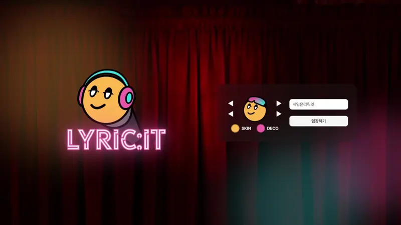
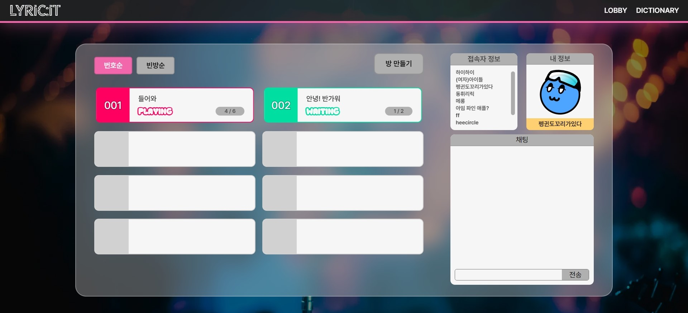
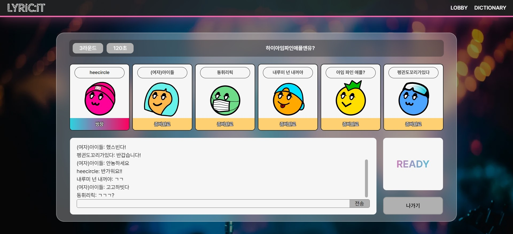
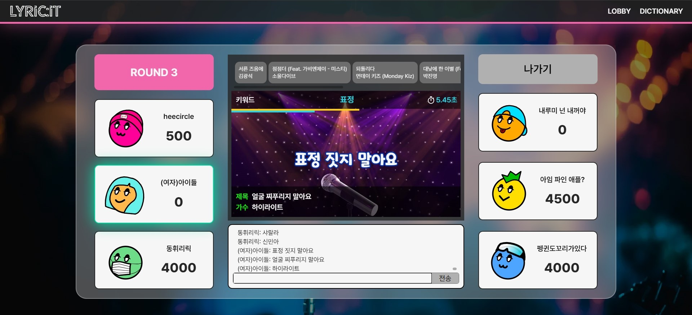
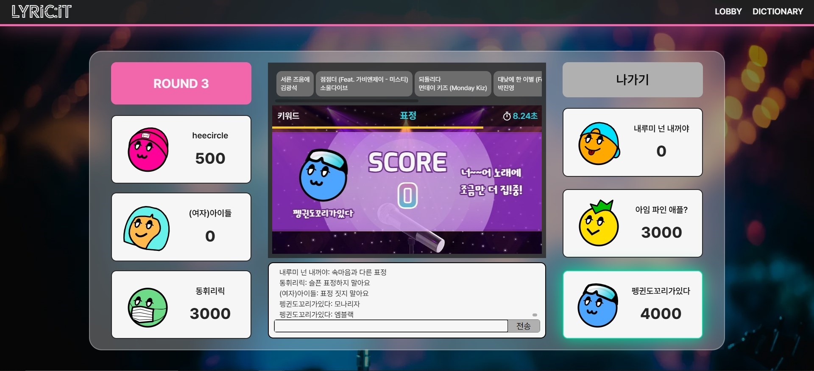

  

---

## 📚 TOC

- [FRONTEND TEAM](#🤝-frontend)
- [ROLE](#🙋‍♂️-role)
- [DEPLOY URL](#🕊️-deploy-url)
- [SPECIFICATION](#📝-specification)
- [INTRODUCTION](#📢-introduction)
- [SKILLS](#🛠️-skills)
- [SERVICE LAYOUT](#🏠-service-layout)

 

---

## 🤝 Frontend

|  |  |
| :--------------------------------------------------------------------------------------------------: | :----------------------------------------------------------------------------------------------------: |
|                                [정필모](https://github.com/itsmo1031)                                |                                [김세민](https://github.com/kimgiraffe)                                 |

---

## 🙋‍♂️ Role

### 정필모

- 프론트엔드 리더
- 화면 디자인 설계
- 개발 환경 설정
- 아바타 제작 및 로그인 기능 개발
- 메인 페이지 컴포넌트 개발 및 스토리북 작성
- STOMP JS 웹소켓 통신
- 상태 관리를 위한 Context 작성
- TanStack Query 활용 서버 상태 관리
- Zustand 활용 클라이언트 상태 관리

### 김세민

- 화면 디자인 설계
- 로비 페이지 컴포넌트 개발 및 스토리북 작성
- 대기 방 컴포넌트 개발 및 스토리북 작성
- 게임 페이지 컴포넌트 개발 및 스토리북 작성
- 게임 결과 모달 컴포넌트 개발 및 스토리북 작성
- 사전 페이지 컴포넌트 개발 및 스토리북 작성

---

## 🕊️ Deploy URL

- ✅ front-server : https://dev.lyricit.site
- ✅ back-server : https://api-dev.lyricit.site
- ✅ back-swagger : https://api-dev.lyricit.site/swagger-ui/index.html

 

---

## 📝 Specification

- notion : https://takealook97.notion.site/lyricit-b33c49f68e194e3692008dc9b8839c68

 

---

## 📢 Introduction

### main-service

- **LYRIC:IT (리릭잇)**
- 노래 가사 기반 게임 서비스
- 채팅 기능을 통해 웹 기반의 인터렉티브한 소통형 게임을 즐길 수 있다.
- 가사 데이터를 전처리하여 단어 별 빈도를 기준으로 랜덤 키워드를 라운드마다 제시한다.
- 키워드가 포함된 가사를 입력한뒤, 해당 가사를 포함하는 곡의 제목과 가수를 입력한다.
- 정답을 맞추면 라운드마다 선착순 별로 차등된 점수를 획득한다.

### sub-service

- 가사 키워드 데이터 사전 검색 기능

 

---

## 🛠️ Skills

### language

- TypeScript

### core

- Next.js 14
- WebSocket (STOMP)

### styling

- Tailwind CSS
- Framer Motion

### state

- Zustand
- TanStack Query

### test

- Storybook

 

---

## 🏠 Service Layout

|  |  |
| :--------------------------------------: | :------------------------------: |
|                Main Page                 |              Lobby               |

|  |  |
| :-----------------------------: | :-----------------------------: |
|              Room               |              Game               |

|  |  |
| :---------------------------------------: | :-------------------------------------: |
|              Correct Answer               |              Wrong Answer               |

|  |  |
| :-------------------------------: | :-----------------------------------: |
|              Result               |              Dictionary               |
